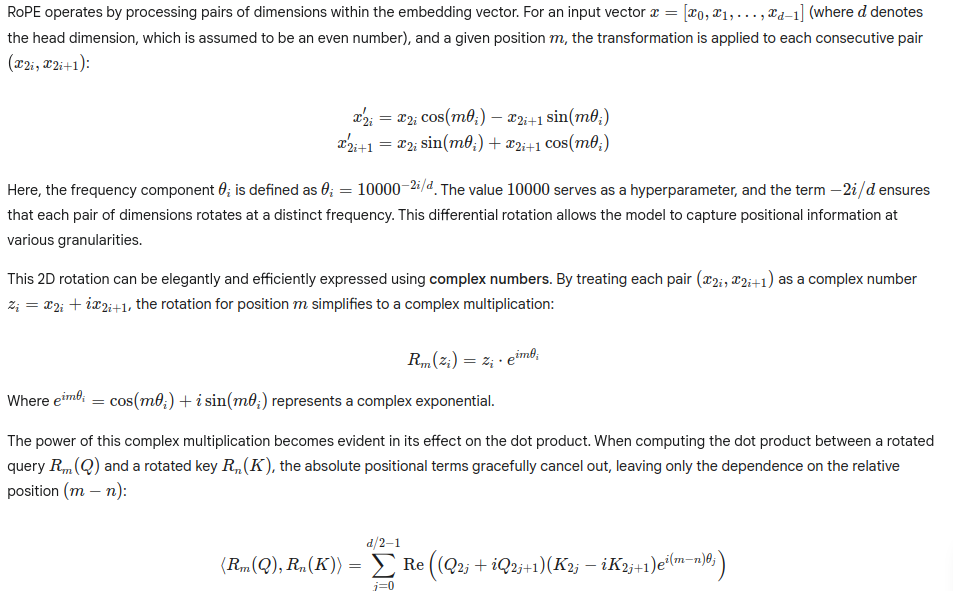

### Rotary Positional Embeddings (RoPE) 

This document provides a theoretical overview of Rotary Positional Embeddings (RoPE), a positional encoding technique used in Transformer models, particularly relevant to modern Large Language Models (LLMs). This explanation aligns with the accompanying PyTorch implementation of a simplified RoPE.

The Problem: Why Positional Encoding in Transformers?

The core of the Transformer architecture, the self-attention mechanism, processes input sequences without inherent knowledge of token order. If you were to shuffle the words in a sentence, a pure self-attention layer would produce the same output. However, in natural language, word order is paramount for meaning (e.g., "The dog bit the man" vs. "The man bit the dog").

To address this, positional encodings are introduced. These are signals added to the token embeddings, providing the model with information about the absolute or relative position of each token in the sequence.

### The Core Idea of RoPE: Relative Position through Rotation

RoPE's innovation lies in its ability to encode relative positional information directly into the self-attention mechanism's dot product. Instead of simply adding a position vector, RoPE applies a rotation to the Query (Q) and Key (K) vectors based on their absolute positions.

The design ensures that the dot product between a query at position m and a key at position n (after applying RoPE) implicitly captures their relative distance (m−n):

```math
⟨f(Q,m),f(K,n)⟩=g(Q,K,m−n)
```

Where:
- f(⋅,⋅) is the function applying the positional embedding (the rotation).
- g(⋅,⋅,⋅) is a function that depends only on the content of Q and K and their relative distance (m−n).

This property is highly beneficial for:

- Generalization: Models trained with RoPE can generalize more effectively to sequence lengths longer than those encountered during training (extrapolation).

- Robustness: The relative positional information is consistent regardless of the absolute position in the sequence.

### Mathematical formulation : 

[](https://github.com/Sagor0078/llm-under-the-hood)

### RoPE in the Provided PyTorch Codebase

The provided PyTorch implementation (simple_rotary_embedding_torch.py or similar) directly translates this mathematical framework:
precompute_simple_rope_frequencies(head_dim, max_seq_len, device, theta):
This function pre-calculates the freqs_complex tensor.

- It computes the θi values.
- It generates absolute position indices m.
- It then computes the m \theta_i values for all positions and frequency components.
- Finally, it converts these into the complex exponential form e^imθ using torch.polar, which are the actual rotation factors. This precomputation is done once to optimize performance during inference.

apply_simple_rope_torch(x, freqs_complex, position_indices, device):
- This function takes an input tensor x (representing a Query or Key vector) and applies the rotation.
- torch.view_as_complex(): This crucial step transforms the real-valued input tensor x by treating pairs of its last dimension as the real and imaginary parts of complex numbers.
- The relevant precomputed freqs_complex (the rotation factors) for the current token's position are selected and broadcasted.
- The core rotation is performed by element-wise complex multiplication: x_complex * freqs_complex_selected.
- torch.view_as_real(): Converts the rotated complex numbers back into real-valued pairs.
- The tensor is then reshaped back to its original dimensions.

By employing RoPE, the Transformer model can effectively understand the order and relationships between tokens in a sequence, leading to improved performance and better generalization capabilities in LLMs, especially when dealing with long contexts.

### References

- [RoFormer: Enhanced Transformer with Rotary Position Embedding](https://arxiv.org/abs/2104.09864)
- [LLaMA: Open and Efficient Foundation Language Models](https://arxiv.org/abs/2302.13971)
- [Mistral: Faster and Better LLMs](https://mistral.ai/news/mistral-7b/)
- YT Tutorial Link : https://www.youtube.com/watch?v=Kv90HQY9lZA
